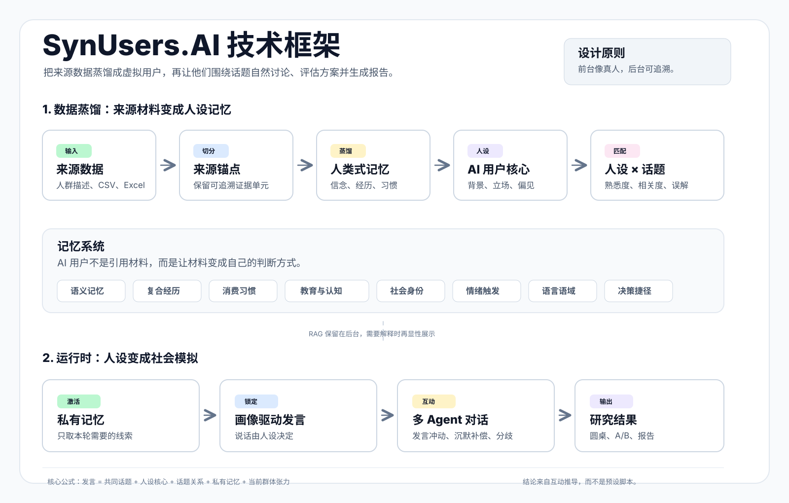

# SynUsers.AI

**Source-grounded synthetic users for AI user research and social simulation.**

SynUsers.AI turns audience descriptions, CSV/Excel/Word/TXT files, and optional topic material into AI virtual users that can speak, disagree, hesitate, and reason from an internal memory system. It is designed for early user research, concept validation, messaging tests, and A/B-style product exploration.

**SynUsers.AI 不是脚本化聊天 Demo。** 它是一个 AI 虚拟用户与社会模拟工作台：把真实来源材料蒸馏成记忆、消费习惯、认知方式、社会身份、情绪触发点和决策捷径，再让多个虚拟用户在同一个议题中自然互动，逐步推导出分歧、顾虑、转折和结论。



## Keywords / 关键词

SynUsers.AI sits in the same broad category as synthetic-user research products, but is built as an open, self-hostable, BYOK-friendly alternative focused on source-grounded persona distillation and multi-agent social simulation.

SynUsers.AI 关注的是 **AI 虚拟调研 / synthetic users / AI persona distillation** 这一类问题，但更强调开源可 fork、自托管、用户自带 API Key、来源数据蒸馏、话题关系建模和群体互动模拟。

SynUsers.AI is an independent project and is not affiliated with Synthetic Users Inc.

**关键词：** 虚拟用户、合成用户、AI 虚拟调研、AI 用户研究、AI 人设蒸馏、来源数据蒸馏、记忆蒸馏、人类式记忆系统、synthetic users、synthetic user research、AI persona、AI persona distillation、source-grounded personas、social simulation、agent-based research、A/B 概念测试、产品概念验证、营销信息测试。

## Quick Start

```bash
npm install
cp .env.example .env
npm run dev
```

Open:

```text
http://localhost:3000
```

You can configure the model in either place:

- `.env`: best for local development and self-hosting.
- Top-right model settings: best for quick trials, demos, and BYOK usage.

Build for production:

```bash
npm run build
npm run start
```

## 中文

### 产品定位

SynUsers.AI 面向产品团队、用户研究、增长实验和早期战略判断。它不会把模拟结果包装成真实市场数据，也不会取代真实访谈、问卷或统计实验；它更像一个 **pre-research workspace**：在投入真实调研成本之前，先快速发现用户可能怎么误解、反对、犹豫、被说服，或者在哪些地方产生分歧。

它的核心不是“让 AI 引用材料”，而是让真实材料变成虚拟用户的内在结构。前台看到的是自然对话；后台保存来源锚点、记忆激活和可解释链路。

### 产品如何工作

一次圆桌模拟会经历五层处理：

1. **来源输入**：目标人群描述，或 CSV、Excel、Word、TXT 等真实材料。
2. **来源锚点**：系统把材料切分成可追溯的证据单元。
3. **记忆蒸馏**：从材料里提炼稳定信念、复合经历、消费习惯、认知方式、社会身份、情绪触发、语言语域和决策捷径。
4. **话题关系**：把每个虚拟用户和当前议题交叉分析，生成熟悉度、相关度、可能误解和判断入口。
5. **社会模拟**：多个 AI 用户根据画像、记忆、话题关系和最近对话轮流发言，最后形成报告。

结论不是预设脚本，而是多个 agent 在同一社会情境中互动出来的结果。

### 来源数据与记忆蒸馏

SynUsers.AI 的核心优势是把来源数据转化成 **可行动的人类式记忆系统**：

| 记忆层 | 它回答的问题 | 在对话中的表现 |
| --- | --- | --- |
| 语义记忆 | 这个人群稳定相信什么、知道什么、误解什么 | “我会先看它到底省不省时间” |
| 复合经历记忆 | 多条材料共同指向的典型经历 | “我们团队上次换工具就卡在迁移上” |
| 消费习惯 | 预算、订阅疲劳、替代方案、审批链路 | “再多一个月费我会很烦” |
| 教育与认知方式 | 抽象能力、词汇密度、术语理解和推理方式 | 有人看 ROI，有人只看是否好上手 |
| 社会身份 | 职业角色、团队责任、家庭责任、圈层压力 | “我不是自己用，还要说服团队” |
| 情绪触发 | 什么会让它兴奋、警惕、防御或厌烦 | 对强制绑定、隐形涨价、隐私风险更敏感 |
| 语言语域 | 句长、直接程度、信息密度、术语密度 | 影响节奏和语气，不作为口头禅重复 |
| 决策捷径 | 判断产品、价格、风险和可信度的经验法则 | “先试用三天，不顺手就走” |

虚拟用户不应该说“根据 E12 证据”。它应该像真人一样说：“我可能不会马上买，我已经有几个订阅了，再多一个月费有点烦。”来源材料仍然影响了发言，只是被内化了。

### RAG 机制

SynUsers.AI 采用 **Distillation-first, RAG-backed**：

- **先蒸馏**：来源材料先变成 persona 的记忆、习惯、判断方式和语言语域。
- **再激活**：每轮发言前，后台检索少量相关来源锚点，作为私有记忆线索。
- **自然表达**：聊天时不暴露 evidence id、文件名、行号或“数据显示”。
- **可追溯**：用户需要解释时，可以查看某句话受哪些内在记忆影响，以及背后的来源锚点。

RAG 应该在这些地方显性出现：

- 审核 persona 可信度。
- 查看“为什么会这样想”。
- 生成研究报告和结论来源。
- 审计某个洞察是否被原始材料支持。

RAG 应该在这些地方无感：

- 实时群聊。
- persona 自我介绍。
- A/B 测试中的自然评价和选择理由。
- 任何需要像真人表达的场景。

### 话题关系层

一个自然的虚拟用户不应该对所有话题都同样懂。SynUsers.AI 在生成人设后会做 **Topic Preparation**：

- 主持人获得一段中立的议题 briefing，用来解释背景、边界和关键问题。
- 每个 persona 获得一份“人设 × 话题关系画像”：熟悉度、相关度、了解层级、可能知道的事实、可能误解的地方、判断角度和该话题下会显露的特点。

如果用户上传了「话题资料」，系统会优先使用这些材料；如果配置了 Tavily、Brave Search 或 Serper，也可以加入联网语境；如果都没有，系统会基于 persona 记忆和话题文本做离线推断。

这让对话更真实：有些人会专业，有些人会半懂，有些人只从预算、风险、学习成本或身份压力切入。

### 场景

- **AI 群聊圆桌**：围绕一个议题生成多位虚拟用户，观察不同立场如何互动。
- **A/B 概念测试**：输入多个产品方案、文案、定价或功能包装，让不同人群逐一评价并做强制选择。
- **用户访谈预演**：用 persona 先压测访谈提纲、追问方向和潜在误读。
- **概念压力测试**：在真实调研前发现反对理由、价值主张漏洞和采用障碍。
- **舆情和销售演练**：模拟不同购买意向、风险偏好和身份压力下的回应。

### 技术架构

SynUsers.AI 刻意把系统拆成多个可替换层，而不是把所有逻辑塞进一个 prompt：

```text
Source Files / Audience Description
  -> Population Parser
  -> Source Anchors
  -> Memory Distillation
  -> Persona Core
  -> Topic Preparation
  -> Private Memory Activation
  -> Social Simulation Engine
  -> Natural Conversation / A-B Evaluation
  -> Traceable Report
```

| 层 | 代码位置 | 职责 |
| --- | --- | --- |
| 来源解析 | `lib/population/parse.ts` | 解析 CSV、Excel、Word、TXT，生成来源锚点 |
| 人设蒸馏 | `lib/population/persona-synthesis.ts` | 将来源锚点蒸馏为 memory profile 和 persona 参数 |
| 领域模型 | `lib/persona/types.ts` | 定义 persona、memory、evidence、topic relation 等结构 |
| 话题准备 | `lib/research/topic-preparation.ts` | 生成议题 briefing 和 persona-topic relation |
| 后台检索 | `lib/population/retrieval.ts` | 每轮激活相关来源锚点，但不让角色机械引用 |
| 对话提示 | `lib/engine/prompts.ts` | 把画像、记忆、偏见、情绪和对话阶段组合成 prompt |
| 发言选择 | `lib/engine/speaker-selector.ts` | 根据发言冲动、沉默补偿和张力选择下一位发言者 |
| 状态更新 | `lib/engine/state-updater.ts` | 更新能量、沉默轮次、认知张力和情绪状态 |
| 报告输出 | `lib/engine/reporter.ts` | 将模拟过程整理成 Markdown 报告 |

这种架构的好处：

- **人格生产效率更高**：解析、蒸馏、话题关系和对话模拟可以分别优化。
- **对话更自然**：角色读的是蒸馏后的记忆结构，而不是大段原文。
- **画像和聊天一致**：背景、立场、OCEAN、偏见、记忆和话题关系共同决定每句话。
- **RAG 可追溯但不打扰**：来源锚点保留在后台，前台保持真人感。
- **扩展更清晰**：圆桌、A/B 测试、访谈和舆情预演可以复用同一套 persona/memory 层。
- **模型可替换**：OpenAI-compatible、Gemini-style、router 或本地网关都可以接入。

### 过程可视化

长耗时流程会逐步展示，而不是只显示一个 loading：

- 生成人设：检查输入、组装 prompt、生成基础画像、校验字段、解析话题关系、写入预览。
- 导入来源数据：检查文件、解析材料、切分来源锚点、筛选相关材料、蒸馏记忆系统、写入预览。
- 群聊模拟：标准化画像、嵌入立场、主持人开场、自我介绍、选择发言者、激活记忆、生成发言、更新状态、生成报告。
- A/B 测试：方案属性拆解、人群画像生成、单方案代入式评价、强制选择和结果汇总。

### 模型配置与 BYOK

SynUsers.AI 需要用户提供模型服务配置。你可以：

- 写入 `.env`：适合 fork 后本地开发或自部署。
- 在页面右上角快速填写：适合快速试用和演示。

页面填写的 API Key 默认只保存在当前浏览器会话的 `sessionStorage`，不写入服务器、数据库或仓库。

OpenAI-compatible 协议可以接入：

- OpenAI
- OpenRouter
- ZenMux
- Routify
- SiliconFlow
- DeepSeek
- Qwen / DashScope 兼容网关
- Moonshot / Kimi 兼容网关
- Together / Groq
- LM Studio / Ollama 本地 OpenAI-compatible 网关
- 企业内部 OpenAI-compatible 网关

示例：

```text
Protocol: OpenAI-compatible
Base URL: https://api.openai.com/v1/chat/completions
Model: gpt-4o-mini
API Key: sk-...
```

如果服务商只给 `/v1` 根地址，SynUsers.AI 会自动补成 `/chat/completions`。OpenRouter 请求会自动附带 `HTTP-Referer` 和 `X-Title`。

### 环境变量

| 变量 | 说明 |
| --- | --- |
| `LLM_API_KEY` | OpenAI-compatible 接口密钥 |
| `LLM_API_URL` | Chat Completions 接口地址 |
| `LLM_MODEL` | OpenAI-compatible 模型名，默认 `gpt-4o-mini` |
| `GEMINI_API_KEY` | Gemini 模式接口密钥 |
| `GEMINI_API_URL` | Gemini Vertex-style 接口基础地址 |
| `GEMINI_MODEL` | Gemini 模型名，默认 `gemini-1.5-pro` |
| `WEB_RESEARCH_ENABLED` | 是否启用可选联网话题研究 |
| `WEB_SEARCH_PROVIDER` | `tavily`、`brave` 或 `serper` |
| `WEB_SEARCH_API_KEY` | 通用搜索 API Key |
| `WEB_SEARCH_MAX_RESULTS` | 每次搜索结果数量 |
| `WEB_SEARCH_TIMEOUT_MS` | 联网检索超时 |
| `TOPIC_PREPARATION_TIMEOUT_MS` | 话题关系生成超时 |
| `TAVILY_API_KEY` | Tavily 专用 key |
| `BRAVE_SEARCH_API_KEY` | Brave Search 专用 key |
| `SERPER_API_KEY` | Serper 专用 key |

### 页面与目录

| 路径 | 功能 |
| --- | --- |
| `/` | 首页配置入口，支持圆桌讨论和 A/B 测试 |
| `/personas` | AI 人设预览 |
| `/chat` | 实时圆桌模拟 |
| `/report` | Markdown 研究报告 |
| `/abtest/config` | A/B 测试方案和画像审核 |
| `/abtest/process` | A/B 测试实时评估日志 |
| `/abtest` | A/B 测试结果页 |

```text
app/                      Next.js App Router 页面和 API routes
components/               页面组件和 UI 组件
lib/persona/              Persona、记忆、来源锚点、话题关系等领域模型
lib/population/           文件解析、来源锚点、记忆蒸馏和后台检索
lib/research/             可选联网话题研究和话题关系准备
lib/engine/               对话模拟、发言选择、状态更新、LLM 调用和报告
public/                   静态资源
```

### 适合与不适合

适合：

- 正式调研前的产品概念压力测试。
- 对比 slogan、功能包装、定价叙事或落地页主张。
- 探索不同人群对同一议题的分歧。
- 发现第一反应、误读、顾虑和反对理由。
- 为访谈、问卷和可用性测试生成更好的假设。

不适合：

- 不能当成真实市场数据。
- 不能当成真实用户访谈记录。
- 不能替代统计显著性测试。
- 不应在没有人工判断和真实世界校验时做高风险决策。

### 研究来源

SynUsers.AI 的设计受到社会模拟、LLM agent、人群样本模拟、心理学、说服理论和决策科学启发：

| 方向 | 在产品中的作用 | 代表文献 |
| --- | --- | --- |
| Agent-based social simulation | 将群体结果视为个体 agent 互动后的涌现 | Epstein & Axtell, *Growing Artificial Societies* (1996) |
| Generative agents | 使用 LLM agent 的记忆、反思和规划模拟可信行为 | Park et al., *Generative Agents* (2023) |
| LLM human simulation | 用语言模型模拟样本或实验参与者 | Aher et al. (2023), Argyle et al. (2023) |
| Thematic analysis | 从来源材料中提炼主题、矛盾、语言和决策标准 | Braun & Clarke (2006) |
| Data-driven personas | 从数据中构建可解释的人群代表 | Salminen et al. (2022) |
| Cognitive dissonance | 衡量观点冲突和态度调整 | Festinger (1957) |
| Opinion dynamics | 观察意见收敛、分裂和阵营形成 | Hegselmann & Krause (2002) |
| Elaboration Likelihood Model | 区分深度加工和线索驱动的说服路径 | Petty & Cacioppo (1986) |
| Big Five / OCEAN | 用人格维度塑造差异化角色 | McCrae & John (1992) |
| Heuristics and biases | 解释非完全理性的判断 | Tversky & Kahneman (1974) |
| Prospect theory | 描述损失厌恶、风险感知和价值判断 | Kahneman & Tversky (1979) |
| Theory of Planned Behavior | 从态度、规范和控制感解释行为意向 | Ajzen (1991) |
| Spiral of Silence | 模拟少数派或低外向个体何时沉默 | Noelle-Neumann (1974) |

## English

### What It Is

SynUsers.AI is a research-backed workspace for source-grounded synthetic users. It helps teams turn audience material into memory-shaped AI personas, then place those personas into group discussions, A/B concept tests, and other research scenarios.

It is not a replacement for real research. It is a way to ask better questions earlier: What will people misunderstand? Where will they object? Which arguments feel credible? Which users are directly affected, and which users only care indirectly?

### Core Idea

The product is built around one principle:

> The virtual user should not quote the source. The source should become the user's memory.

Uploaded material is parsed into traceable source anchors, distilled into human-like memory structures, and used privately during conversation. The user sees natural speech; the system keeps evidence, memory activation, and report traceability in the background.

### Architecture

```text
Source Files / Audience Description
  -> Population Parser
  -> Source Anchors
  -> Memory Distillation
  -> Persona Core
  -> Topic Preparation
  -> Private Memory Activation
  -> Social Simulation Engine
  -> Natural Conversation / A-B Evaluation
  -> Traceable Report
```

| Layer | Purpose |
| --- | --- |
| Source parsing | Turn CSV, Excel, Word, and TXT into source anchors |
| Memory distillation | Extract beliefs, composite experiences, habits, cognitive style, identity, triggers, language register, and decision heuristics |
| Persona core | Maintain background, personality, stance, OCEAN, biases, triggers, and friction topics |
| Topic preparation | Calibrate each persona's familiarity, relevance, likely misunderstandings, and decision angles |
| Private retrieval | Activate relevant evidence silently before each turn |
| Social simulation | Select speakers, update tension, track silence, and let attitudes shift |
| Reporting | Turn the trace into readable research output |

### RAG Mechanism

SynUsers.AI is **distillation-first and RAG-backed**.

RAG is visible when users audit a persona, inspect why a message was generated, or read a report. It stays invisible during live conversation, persona introductions, and natural A/B evaluation. This keeps the experience human while preserving traceability.

### Topic Fit

Virtual users should not sound equally informed about every topic. Topic Preparation creates:

- A neutral briefing for the moderator.
- A persona-topic relation profile for each virtual user.

The relation profile includes familiarity, relevance, exposure level, likely known facts, likely misunderstandings, decision angles, and traits that should show up in this topic.

Topic material uploaded by the user has the highest priority. Optional live search can add fresh context. If neither is available, SynUsers.AI falls back to offline inference.

### Use Cases

- Early product concept stress-testing.
- Messaging, slogan, landing-page, and pricing exploration.
- A/B concept testing across audience segments.
- User interview rehearsal.
- Public-opinion or sales objection rehearsal.
- Hypothesis generation before real surveys or interviews.

### BYOK and Model Routing

SynUsers.AI supports `.env` configuration and quick in-browser BYOK setup. Browser-entered keys are stored in `sessionStorage` for the current tab session and are not written to the server, database, or repository.

Supported routing styles include OpenAI-compatible Chat Completions endpoints and Gemini Vertex-style endpoints. Common providers and routers include OpenAI, OpenRouter, ZenMux, Routify, SiliconFlow, DeepSeek, Qwen/DashScope-compatible gateways, Moonshot/Kimi-compatible gateways, Together, Groq, LM Studio, Ollama, and internal company gateways.

### Limitations

SynUsers.AI should not be treated as real market data, a transcript from real users, or a statistically significant experiment. It is a pre-research tool for exploration, pressure testing, and hypothesis building. Real-world validation still matters.

### References

- Epstein, J. M., & Axtell, R. (1996). *Growing Artificial Societies: Social Science from the Bottom Up*. MIT Press. https://mitpress.mit.edu/9780262050531/growing-artificial-societies/
- Park, J. S., O'Brien, J., Cai, C. J., Morris, M. R., Liang, P., & Bernstein, M. S. (2023). *Generative Agents: Interactive Simulacra of Human Behavior*. UIST 2023. https://doi.org/10.1145/3586183.3606763
- Aher, G. V., Arriaga, R. I., & Kalai, A. T. (2023). *Using Large Language Models to Simulate Multiple Humans and Replicate Human Subject Studies*. ICML 2023. https://proceedings.mlr.press/v202/aher23a.html
- Argyle, L. P., Busby, E. C., Fulda, N., Gubler, J. R., Rytting, C., & Wingate, D. (2023). *Out of One, Many: Using Language Models to Simulate Human Samples*. Political Analysis. https://www.cambridge.org/core/product/identifier/S1047198723000025/type/journal_article
- Lewis, P., Perez, E., Piktus, A., et al. (2020). *Retrieval-Augmented Generation for Knowledge-Intensive NLP Tasks*. NeurIPS 2020. https://arxiv.org/abs/2005.11401
- Braun, V., & Clarke, V. (2006). *Using Thematic Analysis in Psychology*. Qualitative Research in Psychology. https://doi.org/10.1191/1478088706qp063oa
- Salminen, J., Jansen, B. J., Jung, S.-G., et al. (2022). *Data-Driven Personas*. Springer. https://link.springer.com/book/10.1007/978-3-031-02231-9
- Festinger, L. (1957). *A Theory of Cognitive Dissonance*. Stanford University Press. https://psycnet.apa.org/record/1993-97948-000
- Hegselmann, R., & Krause, U. (2002). *Opinion Dynamics and Bounded Confidence: Models, Analysis and Simulation*. Journal of Artificial Societies and Social Simulation. https://www.jasss.org/5/3/2.html
- Petty, R. E., & Cacioppo, J. T. (1986). *The Elaboration Likelihood Model of Persuasion*. Advances in Experimental Social Psychology. https://doi.org/10.1016/S0065-2601(08)60214-2
- McCrae, R. R., & John, O. P. (1992). *An Introduction to the Five-Factor Model and Its Applications*. Journal of Personality. https://doi.org/10.1111/j.1467-6494.1992.tb00970.x
- Tversky, A., & Kahneman, D. (1974). *Judgment under Uncertainty: Heuristics and Biases*. Science. https://doi.org/10.1126/science.185.4157.1124
- Kahneman, D., & Tversky, A. (1979). *Prospect Theory: An Analysis of Decision under Risk*. Econometrica. https://www.econometricsociety.org/publications/econometrica/browse/1979/03/01/prospect-theory-analysis-decision-under-risk
- Ajzen, I. (1991). *The Theory of Planned Behavior*. Organizational Behavior and Human Decision Processes. https://doi.org/10.1016/0749-5978(91)90020-T
- Noelle-Neumann, E. (1974). *The Spiral of Silence: A Theory of Public Opinion*. Journal of Communication. https://doi.org/10.1111/j.1460-2466.1974.tb00367.x

## Notes

- There is no built-in auth or permission system yet.
- Most page state lives in the browser session; refreshing can clear an active simulation.
- `.env` is ignored by git. Do not commit real API keys.
- The Interview mode is currently a reserved UI entry.
